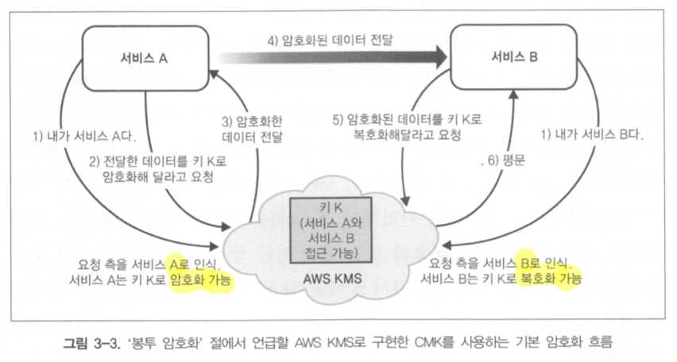
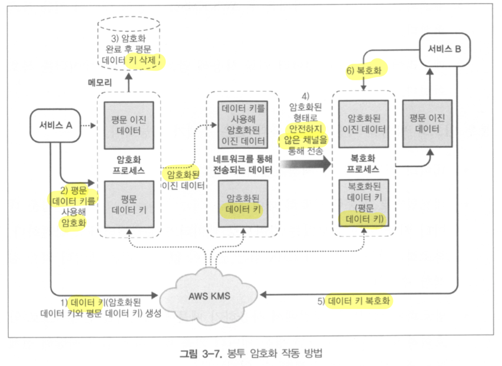
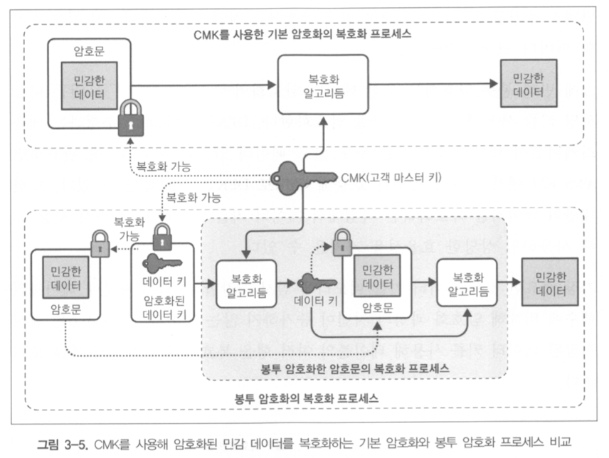
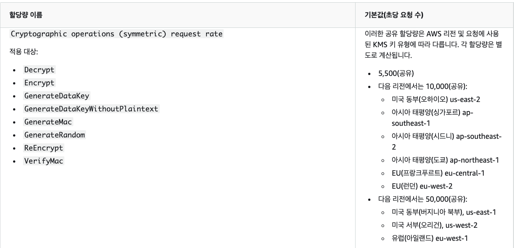
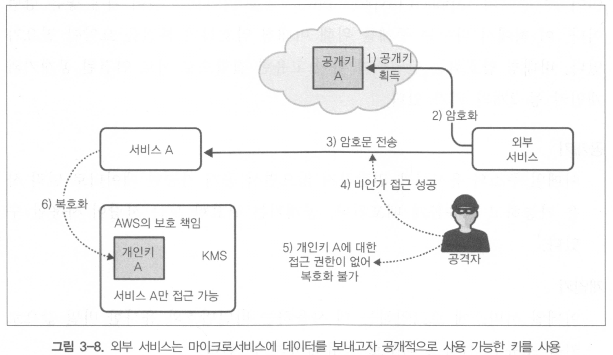
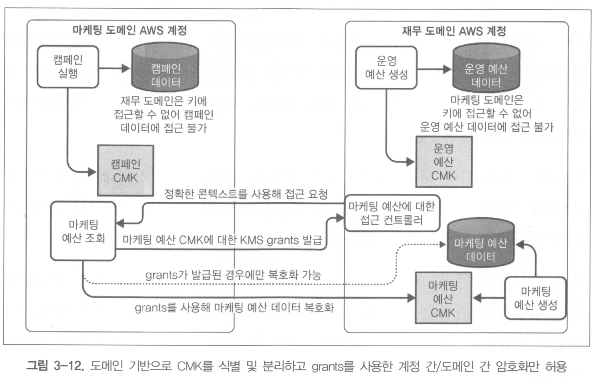

# 암호화의 기초

> 책에 나오는 'CMK'가 'KMS key'로 바꼈기 때문에 수정해서 정리함

## 용어정리

1. 평문 데이터

- 암호화하려는 파일/대상

2. 데이터 키

- 평문 데이터를 암호화 하는데 사용하는 알고리즘 입력값(like 비밀번호)

3. 암호문 데이터

- 암호화 된 데이터

암호화 유형

- 암/복호화 키
  - 동일한 경우 '대칭키 암호화'
  - 다른 경우 '비대칭키 암호화'

## AWS KMS

- 암호화키를 보호하고자 제공하는 도구 모음
- 암/복호화 및 단순 접근 등 키를 사용한 모든 작업의 로그를 저장하고 감사 추적이 가능함
- AES-256 알고리즘 사용
- 고객 마스터키(CMK)를 쉽게 생성, 관리, 통제 가능

장점

1. CMK 안전하고 내구성 있는 장소에 보관
2. CMK에 대한 접근 통제
3. CMK 고가용성 보장

### 기본 암호화

- 평문 데이터 크기가 4KB 미만인 경우 'AEK-256'으로 암/복호화 가능
  

1. CMK를 KMS 내부에 생성 및, 서비스별 접근 허용
2. KMS에 데이터 암호화 요청
3. KMS에서 서비스 A 인증/인가 후 암호화 처리한 데이터 응답
4. 서비스 A -> B로 데이터 전달
5. 서비스 B에서 KMS에 복호화 요청
6. KMS에서 서비스 B 인증/인가 후 복호화 한 평문 데이터 응답

#### AES-256 알고리즘 & 키 공간

- 키 공간(keyspace)은 해당 알고리즘으로 암호화 하는 과정에서 키가 '가질 수 있는 값의 범위'를 의미한다. 해당 키 공간으로 무차별 대입에 걸리는 시간을 추측 할 수 있다.

---

### 봉투 암호화

**차이점**

1. 데이터 키 2개 생성(기본, 암호화 된 버전)
2. 기본 데이터 키는 데이터 암호화 이후 삭제
3. 복호화시 데이터 키를 복호화해서 평문 데이터 키로 데이터 복호화 진행

- KMS key를 통해서 '데이터 키'를 복호화 함(KMS key 접근 권한으로 데이터 안전 보장)
- 데이터 반복 암/복호화를 위한 평문 데이터 키를 서비스 메모리에 임시 저장(캐싱)이 가능
- 데이터와 키 저장소를 분리함

### 추가 인증 데이터(AAD)

- 암/복호화 요청에서 필요한 평문 문자열
- 평문 데이터로 민감한 정보는 사용하지 않아야 함
- 암호화된 데이터의 무결성과 신뢰성을 확인하고자 사용됨
- `"encryptionContext" : { "key": "value" }`

### KSM Policy

- 리소스 기반 정책 사용
- 연결된 KMS key에만 적용됨

### KMS Grants

- KMS 키 접근 통제, 모니터링 활성화를 위함
- 권한이 있는 주체(A)가 권한이 없는 주체(B)에게 권한을 '허용'하는 경우(거부는 못함)
- 제약조건(constraints)를 사용해서 세분화해서 부여 가능

### KMS ViaService

- 도메인 보안과 관계없이 외부 서비스가 키에 접근 가능하도록 함
- 지정한 AWS 서비스만 KMS key 사용 가능
- `"Condition" : { "StringEquals" : { "kms:ViaService" : ... } }`

### 구성 요소

- 메타데이터: ID, ARN, Tag 등
- 별칭: 별도 이름
- 구성 요소: 암호화 과정에 필요한 데이터
  - KMS에서 가져와서 관리 가능 -> 키 수명주기 규제 준수 방법 제공, 삭제 사고 방지를 위한 제약 등을 부여

### 유형

AWS 관리형

- 고객이 소유하지만 AWS가 관리
  고객 관리형
- 공동 책임 모델에서 벗어나 특정 책임이 필요함

### 자동 키 교체

- '키 교체': 암호화에서 사용하는 '배킹 키' 구성 요소를 변경함
- 새로운 Key를 생성하고 별칭 변경
- 고객 관리형 Key를 새로운 구성 요소로 자동 갱신함
- Key 삭제 전까지 이전 암호화 구성 요소를 삭제하지는 않는다
- 암호화에 최신버전 '배킹 키' 사용, 복호화에 사용시 암호화 시 사용한 '배킹 키'를 찾음
- 비활성화, 삭제 대기를 제외한 AWS 관리형 1095일 주기, 고객 관리형 365일마다 선택적 교체

### 수동 키 교체

- 새로 생성한 Key에 기존 Key 참조를 변경해야 함
- 기존, 신규 모두 접근 가능 한 Key 중 하나로 암호화 된 데이터를 모두 복호화 가능
  - 하나만 접근 가능한 경우엔 복호화 불가능

### Key 삭제

- Key 삭제시 해당 키로 암호화 된 리소스, 데이터를 복호화 할 수 없음
- 삭제 예약을 취소 가능하도록 필수 대기 기간 제공(최소 7일-최대 30일)
- 삭제 대기 중인 Key는 암호화 불가능, 자동 키 교체 대상에서도 제외
- 대기 기간동안 복원 가능

### 기타 사항

#### 리전

- 글로벌 데이터 암호화 고려시엔 해당 리전에서 프로비저닝 된 KMS Key를 사용해서 암/복호화 -> 교차리전 비용발생 최소화

#### 비용

1. KMS 내 Key마다 정해진 요금
2. Key 대상 요청당 요금
3. 계정단위 API 요청량 제한 (적용대상 통합 집계=공유)
   

#### 복잡성

- 규정 준수 관련 정보는 AWS Artifact로 확인 가능
- 펌웨어 업데이트는 독립 감사인이 제어하고, 서버리스 및 완전 관리형 서비스로 운영됨
  - 격리된 VPC내에서 처리하기 위해선 AWS CloudHSM 대안 선택 가능

---

## 비대칭 암호화

> 공개키: 공개 가능한 데이터로 모든 사람 사용 가능  
> 개인키: 비밀번호 유사 값으로 서비스 외부로 누출되서는 안됨  
> 용도: 암/복호화, 디지털 서명
> 알고리즘: RSA

암호화(공개키) - 복호화(개인키)  
-> 키 교환 없이 복호화 가능(수신&발신측 결합도가 낮음)

### 디지털 서명(서명 및 확인)
- 암호화(개인키) - 복호화(공개키)
- 공개키로 복호화 되는 것을 통해 출처의 서비스를 확신함
  

### 고려사항 조언
- '봉투 암호화' 기법 권장, 데이터 키는 암/복호화 시에만 사용
- KMS Key 재사용 금지
- 서로 통신하는 서비스에서만 키 접근 가능하도록 접근 최소화 제한
- 데이터 키 로컬 임시 저장하지 않도록
- KMS 컨텍스트로 부가 인증 수단 추가
- 최소 권한 원칙 IAM Policy로 접근 제한

### KMS 계정 공유

1. 컨텍스트 사용

- 계정 단위로 차단하지 않기 때문에 특정 토폴로지에서 grants로 접근 세분화 통제 가능
- grants 기반 통신 프로토콜이 디버깅 하기 어려움
  

2. Key 관리 전용 계정 관리

- 비지니스 계정과 별도로 중앙 집중화 가능
- 도메인 기반 서비스 대상별 세분화 접근 허용 가능

## Secrets Manager

- IAM Policy 등으로 Secrets Manager 접근 통제하고, 얻은 값으로 다른 리소스 호출
- KMS Key를 사용해서 데이터를 암/복호화 함
